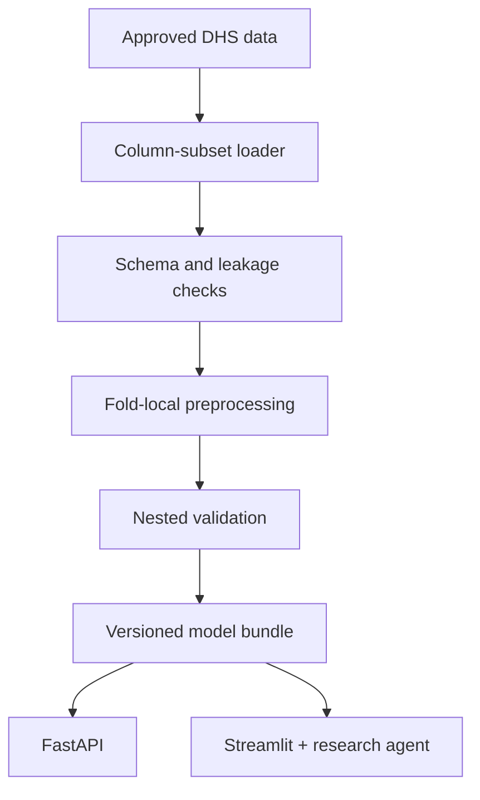

# NFHS-5 High-Parity ML System

[](https://github.com/rjraunak04/nfhs5-high-parity-ml/actions/workflows/ci.yml)
[](https://nfhs5-high-parity-ml.streamlit.app/)
[](https://www.python.org/)
[](app/api.py)
[](LICENSE)

An end-to-end machine-learning project built from my NFHS-5 fertility research. It turns a large survey analysis into a reproducible ML pipeline, an explainable API, a Streamlit application, and an auditable research agent.

**[Try the live application](https://nfhs5-high-parity-ml.streamlit.app/)** · **[Read the model card](docs/MODEL_CARD.md)** · **[Explore the architecture](docs/ARCHITECTURE.md)**

> The system classifies whether high parity was already observed at interview time (`children ever born >= 3`). It does not forecast future fertility, establish causality, or provide medical advice.

## What I built

The original work was a research notebook. I redesigned it as a small production-style ML system:

- memory-efficient ingestion for a 724,115-row NFHS-5 cohort;
- leakage-safe preprocessing and nested model validation;
- locked thresholds derived only from training data;
- geographic validation using Nepal DHS data;
- calibrated probability scoring and subgroup evaluation;
- typed FastAPI endpoints and a Streamlit interface;
- an auditable English/Hinglish research agent;
- automated tests, Docker packaging, and GitHub Actions CI.

The public application uses a deterministic **synthetic model** so that anyone can test the software without exposing licensed DHS microdata.

## Results from the research study

These values are reported from the revised manuscript, not generated by the synthetic public demo.

| Evaluation | Features | ROC AUC | Brier score |
|---|---:|---:|---:|
| India nested cross-validation | 7 | 0.8811 ± 0.0028 | — |
| India untouched holdout | 7 | 0.8839 | 0.1445 |
| Harmonised India holdout | 5 | 0.8708 | 0.1531 |
| Nepal geographic validation | 5 | 0.8488 (95% CI: 0.8426–0.8542) | 0.1523 |

The Nepal calibration slope was 0.7272. I therefore treat the external result as evidence of transportability, not proof that the original probabilities can be used locally without recalibration.

## How the system works



The application keeps prediction logic separate from the interface. The model bundle owns the feature contract, threshold, model version, and demo/research status. Both FastAPI and Streamlit use the same inference layer.

## Auditable research agent

The single agent is deliberately bounded. It can:

1. assess one synthetic scenario;
2. compare two scenarios;
3. answer methodology questions from approved project documents;
4. export a JSON audit report.

The agent may choose a workflow, but it cannot calculate or alter a probability. All scores come from the trained scikit-learn pipeline. Every answer includes the tools used, evidence sources, model version, demo status, and safety disclaimer.

The local English/Hinglish planner works without an API key. An optional LLM planner can improve intent routing while using the same allow-listed tools and deterministic fallback.

See [Agent Guide](docs/AGENT_GUIDE.md) for the design and recruiter demo sequence.

## Repository guide

| Path | Purpose |
|---|---|
| [`app/`](app/) | FastAPI and Streamlit entry points |
| [`src/fertility_risk/`](src/fertility_risk/) | Data, training, evaluation, inference, and agent modules |
| [`tests/`](tests/) | Schema, leakage, API, inference, and agent tests |
| [`scripts/`](scripts/) | Reproducible training, validation, explanation, and evaluation commands |
| [`configs/`](configs/) | Versioned experiment configuration |
| [`docs/`](docs/) | Architecture, model card, data card, deployment, and agent documentation |
| [`research/`](research/) | Manuscript-reported result summaries; no raw participant data |
| [`notebooks/`](notebooks/) | Guided walkthroughs; package code remains the source of truth |

## Run locally

### Python

```bash
git clone https://github.com/rjraunak04/nfhs5-high-parity-ml.git
cd nfhs5-high-parity-ml
python -m venv .venv
```

Activate the environment:

```powershell
# Windows PowerShell
.\.venv\Scripts\Activate.ps1
```

```bash
# macOS or Linux
source .venv/bin/activate
```

Install and start the application:

```bash
python -m pip install --upgrade pip
pip install -e ".[app,dev]"
python scripts/train_demo_model.py
pytest
streamlit run app/dashboard.py
```

For the API:

```bash
uvicorn app.api:app --reload
```

- Dashboard: `http://localhost:8501`
- API documentation: `http://127.0.0.1:8000/docs`
- Health endpoint: `http://127.0.0.1:8000/health`

### Docker

```bash
docker compose up --build
```

## API example

```bash
curl -X POST http://localhost:8000/v1/predict \
  -H "Content-Type: application/json" \
  -d '{
    "current_age": 31,
    "residence": 2,
    "education": 2,
    "wealth": 3,
    "in_union": 1
  }'
```

The same input contract is used by the dashboard, batch endpoint, and agent tools.

## Train with approved DHS data

Licensed NFHS/DHS files are never committed. After receiving authorised access:

```bash
pip install -e ".[train]"
python scripts/train_research_model.py \
  --india-dta /secure/path/IAIR7EFL.DTA \
  --output-dir outputs/research \
  --mode full
```

For the harmonised India-to-Nepal model:

```bash
python scripts/train_research_model.py \
  --india-dta /secure/path/IAIR7EFL.DTA \
  --feature-set transport \
  --output-dir outputs/transport \
  --mode full

python scripts/validate_nepal.py \
  --model outputs/transport/transport_model_bundle.joblib \
  --nepal-dta /secure/path/NPIR82FL.DTA \
  --output-dir outputs/nepal
```

## Engineering checks

Every push is checked for:

- Ruff linting;
- automated Python tests with coverage;
- deterministic demo-model creation;
- agent routing and safety evaluation;
- API and dashboard runtime acceptance;
- Docker image build.

Run the same checks locally:

```bash
ruff check .
pytest
python scripts/evaluate_agent.py
```

## Key design decisions

- **No leakage:** outcome-derived fertility variables are excluded from predictors.
- **Fold-safe preprocessing:** imputation and encoding are fitted inside each training fold.
- **Threshold discipline:** thresholds are selected from out-of-fold training predictions and then locked.
- **Honest validation:** India and Nepal models use clearly separated feature contracts.
- **Reproducible demo:** public deployment does not depend on licensed data or private artifacts.
- **Traceable agent:** planning and tool execution are visible instead of hidden behind a chatbot response.
- **Privacy by design:** no DHS microdata, direct identifiers, or user profiles are stored by the application.

## Limitations

This repository is a research and engineering demonstration. The public model is synthetic. The manuscript metrics cannot be reproduced without authorised DHS data, and model associations must not be interpreted as causal or clinical guidance. Real-world use would require local validation, recalibration, privacy review, monitoring, and human oversight.

## Author

**Ankur Kumar Jaiswal**  
M.Sc. Statistics · Machine Learning · Explainable AI · Survey Data Analysis

## License and data access

The source code is available under the [MIT License](LICENSE). DHS microdata are governed separately by the DHS Program data-use agreement and are not included here.
