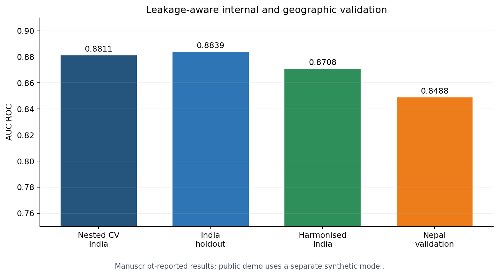
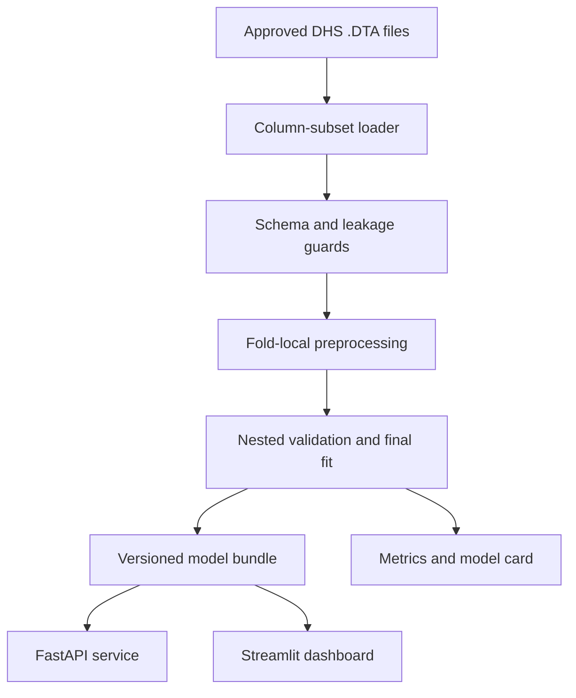

# Explainable High-Parity Classification with NFHS-5

[](https://www.python.org/)
[](https://github.com/rjraunak04/nfhs5-high-parity-ml/actions/workflows/ci.yml)
[](LICENSE)

A production-minded machine-learning project that turns large DHS survey research into a reproducible training pipeline, validated model artifact, REST API, and interactive dashboard.

> This system classifies **observed high parity at the survey interview** (`children ever born >= 3`). It does not predict future fertility, establish causality, or provide clinical advice.



## Why this project is different

- Works with a 724,115-row India NFHS-5 cohort while reading only required Stata columns.
- Prevents target leakage by excluding fertility-history and outcome-derived variables from the primary predictor set.
- Fits imputation and encoding inside training folds.
- Uses nested cross-validation plus a protected holdout set.
- Separates the seven-feature India research model from the five-feature India-to-Nepal transport model.
- Reports discrimination, probability accuracy, calibration, bootstrap uncertainty, and subgroup performance.
- Ships with a deterministic synthetic-data demo, typed API, dashboard, Docker setup, tests, and CI.
- Keeps licensed DHS microdata, fitted research artifacts, and direct identifiers out of Git.

## Research results

The following values are transcribed from the revised manuscript and are not produced by the synthetic demo model.

| Evaluation | Features | AUC ROC | Brier score |
|---|---:|---:|---:|
| India nested CV | 7 | 0.8811 +/- 0.0028 | - |
| India untouched holdout | 7 | 0.8839 | 0.1445 |
| Harmonised India holdout | 5 | 0.8708 | 0.1531 |
| Nepal geographic validation | 5 | 0.8488 (95% CI 0.8426-0.8542) | 0.1523 |

Nepal calibration slope was 0.7272, so probabilities require local recalibration before operational use. See [Model Card](docs/MODEL_CARD.md) for the intended-use boundary and subgroup limitations.

## System design



The public demo uses synthetic records and the five harmonised variables: age, residence, education, wealth, and union status. India-specific protected/contextual attributes such as caste and religion are not exposed in the demo UI.

## Quick start

### Windows PowerShell

```powershell
python -m venv .venv
.\.venv\Scripts\Activate.ps1
python -m pip install --upgrade pip
pip install -e ".[app,dev]"
python scripts/train_demo_model.py
pytest
uvicorn app.api:app --reload
```

Open `http://127.0.0.1:8000/docs` for the interactive API documentation. In a second terminal:

```powershell
.\.venv\Scripts\Activate.ps1
streamlit run app/dashboard.py
```

### Docker

```bash
docker compose up --build
```

- API docs: `http://localhost:8000/docs`
- Dashboard: `http://localhost:8501`

The dashboard supports validated single-record scoring and CSV batches of 1–500 rows. A downloadable template is included in the interface, and scored batches can be exported without exposing any training records.

## API example

```bash
curl -X POST http://localhost:8000/v1/predict \
  -H "Content-Type: application/json" \
  -d '{
    "current_age": 31,
    "residence": 2,
    "education": 2,
    "wealth": 3,
    "in_union": 1
  }'
```

Example response:

```json
{
  "probability": 0.177972,
  "classification": "lower_score",
  "threshold": 0.402197,
  "model_version": "demo-synthetic-v1",
  "demo_only": true
}
```

The exact probability and demo threshold can change when the synthetic artifact is regenerated.

The safe synthetic artifact is generated automatically on first startup when it is absent, so
deployments never depend on committing a large binary model file.

## Train with approved DHS data

Do not commit NFHS/DHS microdata. After receiving access from the DHS Program, keep the `.DTA` file outside the repository and run:

```bash
pip install -e ".[train]"
python scripts/train_research_model.py \
  --india-dta /secure/path/IAIR7EFL.DTA \
  --output-dir outputs/research \
  --mode full
```

Use `--mode quick` for a local smoke test. The loader reads only the required columns, and the training run writes its configuration, data fingerprint, fold metrics, threshold, and model bundle to the output directory.

For the separate transport model and locked Nepal validation:

```bash
python scripts/train_research_model.py \
  --india-dta /secure/path/IAIR7EFL.DTA \
  --feature-set transport \
  --output-dir outputs/transport \
  --mode full

python scripts/validate_nepal.py \
  --model outputs/transport/transport_model_bundle.joblib \
  --nepal-dta /secure/path/NPIR82FL.DTA \
  --output-dir outputs/nepal
```

Optional SHAP output for a governed local batch:

```bash
pip install -e ".[explain]"
python scripts/explain_model.py \
  --model models/demo_transport_model.joblib \
  --input-csv data/demo_batch.csv \
  --output-dir outputs/explanations
```

## Repository map

```text
app/                    FastAPI and Streamlit entry points
configs/                Versioned experiment settings
data/                   Synthetic demo records and data instructions
docs/                   Model card, data card, architecture, interview guide
models/                 Synthetic demo artifact only
notebooks/              Clean walkthrough; package code is the source of truth
research/               Manuscript-reported metrics, not raw data
scripts/                Demo and approved-data training commands
src/fertility_risk/     Reusable data, training, evaluation, inference modules
tests/                  Schema, inference, API, and leakage tests
```

## Reproducibility and governance

- Random seed: `42`
- Primary evaluation: AUC ROC and Brier score
- Threshold selection: training out-of-fold predictions only
- Data policy: raw `.DTA`, local outputs, caches, and fitted research models are ignored by Git
- Artifact contract: every model bundle contains features, threshold, version, training source, and demo/research status
- Interpretation: model explanations are associations within the fitted model, not intervention effects

## Three-day build sequence

Follow [the exact three-day execution and commit plan](docs/THREE_DAY_PLAN.md). It is designed to produce meaningful commits without manufacturing activity just to make the contribution graph greener.

Completion evidence: [Day 1](docs/DAY1_COMPLETION.md) · [Day 2](docs/DAY2_COMPLETION.md) · [Day 3](docs/DAY3_COMPLETION.md)

## Author

**Ankur Kumar Jaiswal** - M.Sc. Statistics; machine learning, survey modelling, explainability, and model evaluation.

## Citation and licensing

Code is released under the [MIT License](LICENSE). DHS data are **not** covered by this license and must be obtained directly under the DHS Program data-use agreement. The manuscript is not included in this repository; add a preprint only after supervisor/journal approval.
