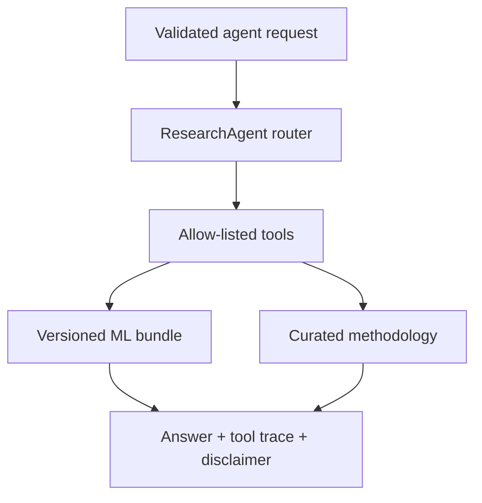
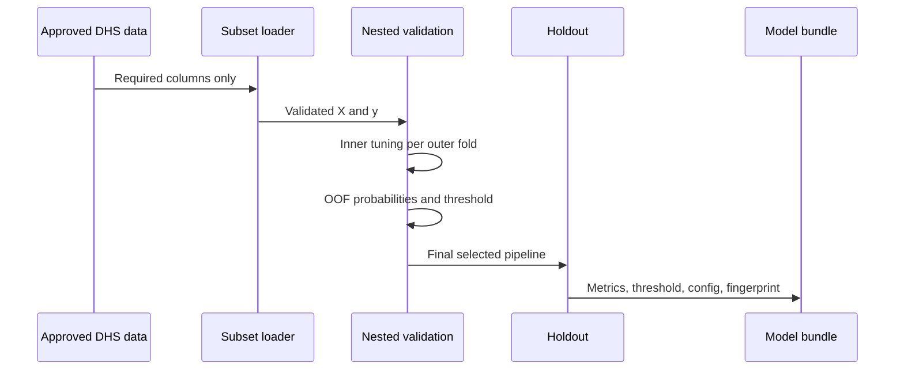

# Architecture and engineering decisions

## Components

| Layer | Responsibility | Failure prevented |
|---|---|---|
| `data.py` | subset read, mapping, validity filtering | Colab RAM exhaustion and silent outcome errors |
| `constants.py` | versioned features and blocked variables | training-serving feature drift and leakage |
| `modeling.py` | fold-safe transformer plus classifier | preprocessing leakage |
| `training.py` | nested tuning, OOF threshold, holdout evaluation | optimistic validation and test threshold tuning |
| `validate_nepal.py` | locked external validation, calibration, weighting, subgroups | accidental Nepal retraining or metric cherry-picking |
| model bundle | pipeline plus metadata contract | untraceable `.pkl` artifacts |
| `schemas.py` | typed ranges and forbidden extra fields | invalid or ambiguous requests |
| `api.py` | health, model, single and batch endpoints | notebook-only inference |
| `dashboard.py` | responsible user-facing demo | unsupported clinical/future-risk framing |
| `agent.py` | single-agent planning and tool orchestration | LLM-generated scores or unrestricted actions |
| `agent_tools.py` | allow-listed prediction, comparison, and methodology tools | hidden tool access and unsupported claims |
| tests and CI | regression checks on every push | broken portfolio deployment |

## Single-agent architecture

The first agent release is deterministic: a typed intent acts as the plan, and the orchestrator
can call only explicitly registered Python tools. This makes every score reproducible and every
tool call visible in the API response. A future natural-language planner can sit in front of this
contract, but it must never calculate or alter model probabilities itself.

Supported intents are:

- `assess_risk`: call the ML pipeline and return a conservative explanation.
- `compare_scenarios`: compare two synthetic model scores without causal language.
- `methodology`: answer from curated project facts rather than inventing evidence.

The Streamlit **Agent assistant** tab is a thin presentation layer over the same `ResearchAgent`
class used by FastAPI. This keeps agent behavior consistent between the browser demo and API clients.

### Natural-language planner

`planner.py` maps short English/Hinglish requests to the three supported intents. Its keyword score,
confidence, rationale, and proposed tools are returned before execution, making routing transparent.
Unknown requests fall back to methodology—the only workflow that does not invoke the prediction
model. This deterministic planner keeps the public demo free of API keys and usage charges. It is
also the stable contract where a governed LLM planner can be added later.

An optional OpenAI Responses API adapter uses Structured Outputs to return only an allowed intent
and a short routing reason. Application code—not the LLM—maps that intent to the fixed tool list.
It is disabled by default, does not store the provider response, and falls back to deterministic
routing on missing configuration or provider failure. Model scoring remains entirely inside the
versioned scikit-learn pipeline.

### Grounding, evaluation, and reporting

Methodology questions search an allow-list of repository documents, split by Markdown section.
Responses include source paths, section names, relevance scores, and short evidence excerpts.
No raw DHS files, arbitrary filesystem paths, or external web content enter the retrieval index.

`scripts/evaluate_agent.py` is an offline quality gate for English/Hinglish routing, safe fallback,
and fixed tool alignment. Each successful workflow also exposes a downloadable JSON audit report;
the service does not persist user profiles or agent conversation history.

## Training sequence

## Why one serialized pipeline

Imputation, one-hot encoding, and the random forest are stored as one scikit-learn `Pipeline`. The API therefore cannot accidentally apply a different category mapping or fit preprocessing on incoming records.

## Why the public app uses synthetic data

DHS microdata are licensed and inappropriate for a public model artifact. A synthetic artifact gives recruiters a one-command working system while preserving the separation between software verification and scientific evidence.

## Production extensions

For a real governed environment, add an artifact registry, authentication, request logging without sensitive payloads, scheduled drift/calibration evaluation, approval gates, model rollback, and country-specific recalibration. Do not add these as decorative dependencies unless they are actually operated and monitored.
