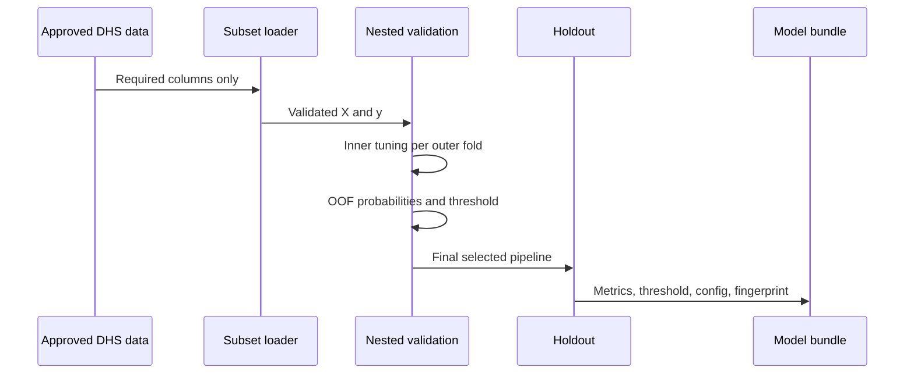

# Architecture and engineering decisions

## Components

| Layer | Responsibility | Failure prevented |
|---|---|---|
| `data.py` | subset read, mapping, validity filtering | Colab RAM exhaustion and silent outcome errors |
| `constants.py` | versioned features and blocked variables | training-serving feature drift and leakage |
| `modeling.py` | fold-safe transformer plus classifier | preprocessing leakage |
| `training.py` | nested tuning, OOF threshold, holdout evaluation | optimistic validation and test threshold tuning |
| `validate_nepal.py` | locked external validation, calibration, weighting, subgroups | accidental Nepal retraining or metric cherry-picking |
| model bundle | pipeline plus metadata contract | untraceable `.pkl` artifacts |
| `schemas.py` | typed ranges and forbidden extra fields | invalid or ambiguous requests |
| `api.py` | health, model, single and batch endpoints | notebook-only inference |
| `dashboard.py` | responsible user-facing demo | unsupported clinical/future-risk framing |
| tests and CI | regression checks on every push | broken portfolio deployment |

## Training sequence

## Why one serialized pipeline

Imputation, one-hot encoding, and the random forest are stored as one scikit-learn `Pipeline`. The API therefore cannot accidentally apply a different category mapping or fit preprocessing on incoming records.

## Why the public app uses synthetic data

DHS microdata are licensed and inappropriate for a public model artifact. A synthetic artifact gives recruiters a one-command working system while preserving the separation between software verification and scientific evidence.

## Production extensions

For a real governed environment, add an artifact registry, authentication, request logging without sensitive payloads, scheduled drift/calibration evaluation, approval gates, model rollback, and country-specific recalibration. Do not add these as decorative dependencies unless they are actually operated and monitored.
